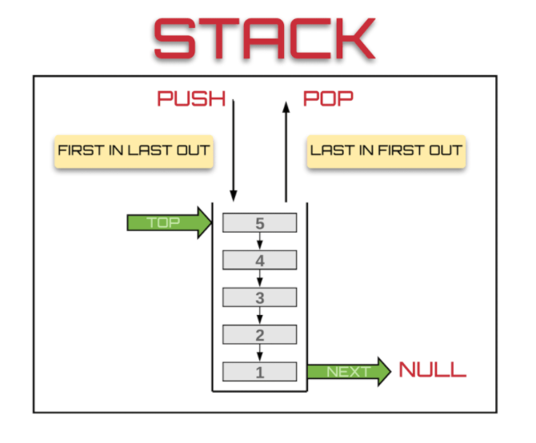

# Stack
 
[출처](https://dev.to/theoutlander/implementing-the-stack-data-structure-in-javascript-4164)

스택이란 층을 쌓는 것 처럼, 한 입구에서 자료를 넣고 뺄 수 있는 LIFO(Last Input First Output) 형식의 자료구조이다.

## Array 형태
Array 형태의 Stack은 간단한 구조이며 뒤에 데이터를 추가하기 편하다는 장점이 있지만, 초반 Stack사이즈보다 크게 데이터가 들어올 경우 기존 Size + 1만큼 데이터를 만들기 때문에 메모리 관리의 효율이 좋지 않은 단점이 있다.

## Linked_List 형태
Linked_List 형태는 포인터를 활용해 서로 연결되어 있는 구조인데 데이터의 삽입 및 삭제가 편하지만, 데이터의 접근 시 순차적으로 접근하기 때문에 데이터 양이 많을 경우 접근 시간이 오래걸리는 단점이 있다.
